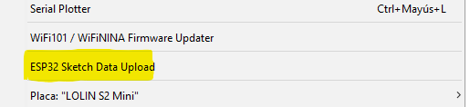

La idea es hacer el ESP32 un servidor cargando una pagina web que se pueda comunicar con el mismo ESP32 para controlar un invernadero.

Para lograrlo, se tienen los siguientes puntos clave:

1. Crear un sistema de archivos en el ESP32
2. Subir una carpeta con los archivos de la pagina web.
3. Hacer que el ESP32 sea un punto de acceso.
4. Hacer que el ESP32 sea un servidor web.
5. Usar wbsockets para la intercomunicacion.
6. Acceder a la página y empezar a controlar el invernadero.

Explicación.

1. SISTEMA DE ARCHIVOS.
   LittleFS es un sistema de archivos diseñado para sistemas embebidos como el ESP32. Permite almacenar y manejar archivos de manera eficiente
   en dispositivos con recursos limitados. Al cargar una carpeta para servir una página web en ESP32, estarías utilizando LittleFS para
   almacenar los archivos HTML, CSS, JavaScript, y otros recursos de la página web en la memoria del ESP32. Esto permite que el ESP32
   pueda servir estos archivos de manera rápida y eficiente cuando se accede a la página web desde un navegador.

   Para este paso es importante contar con una version antigua de Arduino IDE, luego, descomprimir el archivo .rar y en la ruta
   'C:\Users\*usuario*\Documents\Arduino\tools\ESP32FS\tool', pegar el archivo descomprimido. Para subir archivos se tiene que ejecutar el siguiente codigo:
   
   '''cpp
   #include "FS.h"
   #include "LittleFS.h"

   void setup() {
     Serial.begin(115200);
  
     if (!LittleFS.begin()) {
       Serial.println("No se pudo montar LittleFS");
       return;
    }
  
     Serial.println("Formateando LittleFS...");
  
     if (LittleFS.format()) {
       Serial.println("LittleFS formateado con éxito");
    } else {
       Serial.println("Error al formatear LittleFS");
    }
   }
  
   void loop() {
    // El loop está vacío
   }
   '''

   Esto formatea la memoria al formato de LittleFS para poder subir archivos como si se tratara de explorador de windows.

   Luego, en la carpeta donde se está trabajando hay que crear un directorio llamado 'data' y poner dentro, los archivos a cargar. Y en la versión antigua de Arduino IDE aparece la siguiente opción:

   

   Luego de subir los arhivos

